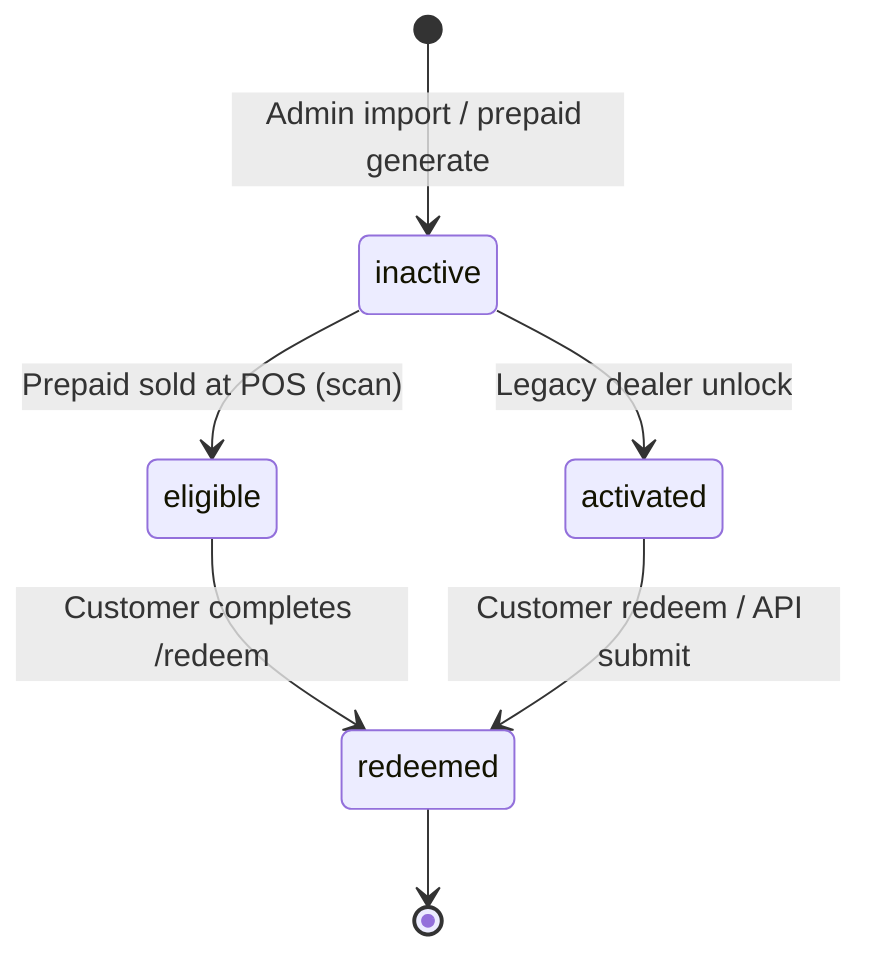

# Dealer mode — use cases

**Product:** USALOCALSIM Activation Portal  
**Audience:** Retail partners, tourism shops, operations, developers  
**Related:** [use-cases.md](./use-cases.md) · [manual-qa-script.md](./feedback/manual-qa-script.md) · [implementation-path-b-hybrid.md](./implementation-path-b-hybrid.md) · [instructions.md](./instructions.md)

---

## 1. What “dealer mode” is

Dealer mode is the **authenticated retail layer** of the portal. After a customer pays at the shop, the dealer (or an admin acting as retail staff) **activates** the product so the customer can redeem online.

The portal supports **two activation models**:

| Model | Typical product | Dealer UI | Voucher state after sale |
|-------|-----------------|-----------|---------------------------|
| **Path B — Prepaid physical card** | Global Data Credit card with serial, barcode, scratch PIN | **`/dealer/scan`** (primary) | `inactive` → **`eligible`** + `paymentStatus: true` |
| **Legacy — Scratch code only** | Imported voucher codes (no `PrepaidCard` row) | **`/dealer`** (legacy unlock) | `inactive` → **`activated`** |

**Tourism / retail entry:** `/retail` redirects to **`/dealer/scan`**.

Customers always redeem at **`/redeem/enter`** (scratch PIN) unless the batch is Three UK exclusive (routed to `/redeem/three-uk`).

---

## 2. Actors and access

| Actor | Role in DB | Dealer routes | Admin routes |
|-------|------------|---------------|--------------|
| **Dealer** | `dealer` | ✅ Full dealer panel | ❌ |
| **Admin** | `admin` | ✅ Same as dealer (POS + unlock + tracking) | ✅ `/admin/*` |
| **Customer** | — | ❌ Public redeem only | ❌ |
| **External POS** | — | Uses **`POST /api/pos/activate`** with `POS_API_KEY` (no browser session) | — |

### Authentication

- **Login:** `/login` with `callbackUrl=/dealer` or `/dealer/scan`
- **Session:** NextAuth credentials; layout enforces `role === "admin"` or `role === "dealer"`
- **Disabled users:** Redirected to sign-out with account-disabled error

### Dealer navigation (`DealerNav`)

| Tab | Route | Purpose |
|-----|-------|---------|
| Scan & sell | `/dealer/scan` | **Primary** — camera/manual scan, POS activate |
| Legacy unlock | `/dealer` | Non-prepaid voucher unlock |
| Tracking | `/dealer/tracking` | Filters on unlocks/redemptions |
| Settings | `/dealer/settings` | Password change (OTP); `/dealer/change-password` redirects here |
| Sign out | — | Ends dealer session |

---

## 3. Voucher lifecycle (dealer perspective)



| DB status | Admin label | Customer can redeem? | How it gets here |
|-----------|-------------|----------------------|------------------|
| `inactive` | **Pending** | No — *"not activated by retailer"* | Stock / before sale |
| `eligible` | **Active** | Yes (prepaid, paid) | **`/dealer/scan`** or **`/api/pos/activate`** |
| `activated` | **Active** | Yes (legacy unlock) | **`/dealer`** unlock |
| `redeemed` | **Redeemed** | No | Customer finished redeem wizard |

**Important:** Prepaid cards linked to a `PrepaidCard` record **cannot** use legacy unlock — they must be sold via scan/POS.

---

## 4. Primary use cases

### UC-D1 — Retail partner: scan and activate prepaid card (Path B)

| Field | Content |
|-------|---------|
| **Goal** | Record payment at the till and make the card redeemable. |
| **Actors** | Dealer (or admin), System, Customer (later) |
| **Preconditions** | User logged in; card exists in DB (`PrepaidCard` + `Voucher`); card not already paid |
| **Trigger** | Customer pays at shop; staff opens **`/dealer/scan`** or **`/retail`** |

**Main success scenario**

1. Staff selects scan type: **QR / serial** or **barcode** (UPC/EAN/Code 128).
2. Staff scans with device camera **or** pastes value manually → **Preview**.
3. **`GET /api/dealer/prepaid-preview`** returns serial, face value, market, voucher status.
4. Staff optionally enters **receipt / external payment id** and **customer email**.
5. Staff confirms **Activate** → **`POST /api/dealer/pos-activate`**.
6. System validates amount matches **face value** (cents), runs **`activatePrepaidCardAtSale`**:
   - Creates **`CartPurchase`** (`status: authorized`) with redemption access token
   - Sets voucher **`eligible`**, **`paymentStatus: true`**, wallet **`creditAmountCents`** from face value
   - Audit: `dealer_pos_activation`
7. UI shows success and **`redeemUrl`** (default `https://{domain}/redeem/enter`).
8. Staff hands card to customer: **Pay → Scratch → Redeem** (PIN on card back).

**Postconditions**

- Customer can enter PIN at `/redeem/enter` without retailer error.
- Admin voucher tracking shows **Active** (not Pending).

**Related routes**

- `/dealer/scan`, `/retail` → `/dealer/scan`
- `GET /api/dealer/prepaid-preview`
- `POST /api/dealer/pos-activate`

**Demo data (after seed)**

- Serial: `USALOCALDEMO123`
- PIN: `SCRATCHDEMO1`
- Face value: $50.00 (5000¢)

---

### UC-D2 — Camera scan (QR, EAN, Code 128)

| Field | Content |
|-------|---------|
| **Goal** | Fast intake without typing serials. |
| **Preconditions** | HTTPS or localhost; camera permission granted |
| **Trigger** | **Start camera** on scan page |

**Main success scenario**

1. Browser uses **BarcodeDetector** when available, else **ZXing** fallback.
2. Detected value fills scan field; staff reviews preview (UC-D1 steps 3–7).

**Alternative flows**

| Condition | Behavior |
|-----------|----------|
| Camera denied / unsupported | Error message; manual entry still works |
| Wrong code | Preview 404 — card not recognized |

---

### UC-D3 — Legacy: single voucher unlock

| Field | Content |
|-------|---------|
| **Goal** | Activate a **non-prepaid** voucher code after sale. |
| **Preconditions** | Voucher `inactive`; **no** linked `PrepaidCard` |
| **Trigger** | **`/dealer/unlock`** → enter code → **Unlock** |

**Main success scenario**

1. Staff enters voucher code (scratch PIN / code as stored in DB).
2. **`POST /api/dealer/unlock`** with `{ code }`.
3. Voucher → **`activated`**, `activatedAt`, `activatedById` = dealer user.
4. Audit: `voucher_unlock`.
5. Recent unlocks table refreshes (auto every 30s).

**Alternative flows**

| Condition | Response |
|-----------|----------|
| Code linked to prepaid card | *"Physical prepaid cards are activated at point of sale…"* |
| Code not found | 404 |
| Already non-inactive | Error / skipped in bulk |

**Postconditions**

- Customer can redeem via legacy **`/api/validate`** + **`/api/submit`** or newer **`/redeem/enter`** flow if voucher is paid/eligible per product rules.

---

### UC-D4 — Legacy: bulk unlock by count

| Field | Content |
|-------|---------|
| **Goal** | Activate the next N inactive **non-prepaid** vouchers (e.g. stack sale). |
| **Preconditions** | Enough inactive vouchers without prepaid rows |
| **Trigger** | **`/dealer/unlock`** → bulk count → **Bulk activate** |

**Main success scenario**

1. UI shows **remaining legacy inactive count** (non-prepaid only) from **`GET /api/dealer/unlock`**.
2. Staff enters count (max 1000 API cap; UI capped by inactive count).
3. **`POST /api/dealer/unlock`** with `{ bulkCount: N }`.
4. System takes oldest **non-prepaid** inactive vouchers (FIFO by `createdAt`) and unlocks them.
5. Response: `unlocked`, `skipped`, `unlockedRows` table.

**Note:** This is **not** “unlock these specific codes” — it is FIFO by `createdAt`. For explicit codes use `{ codes: string[] }` on the same API or the **code list** panel on **`/dealer/unlock`**.

---

### UC-D5 — Legacy: bulk unlock by code list (API)

| Field | Content |
|-------|---------|
| **Goal** | Unlock many known codes in one request. |
| **Trigger** | **`POST /api/dealer/unlock`** with `{ codes: ["A","B",…] }` |

**Outcome per code:** `unlocked` | `not_found` | `not_inactive` (includes prepaid-linked skip).

---

### UC-D6 — Track sales and redemptions

| Field | Content |
|-------|---------|
| **Goal** | See prepaid scan sales and legacy unlocks, and whether customers redeemed. |
| **Trigger** | **`/dealer/tracking`** |

**Main success scenario**

1. Dealer sets filters: **date range**, **sale type** (all / prepaid / legacy), **plan**, **voucher type**, **redeemed / not**.
2. **`GET /api/dealer/tracking`** returns up to **500** merged rows:
   - **Legacy:** vouchers **activated by this user** (`activatedById`, non-prepaid).
   - **Prepaid:** audit log entries `dealer_pos_activation` for this user (Scan & sell), joined to purchase/voucher for redemption status.
3. Columns include code/serial, sale type, status, plan, amount (prepaid), sold at, redeemed by/at.

**Dashboard shortcut**

- **`/dealer/unlock`** shows last **25** legacy unlocks for current user (no filters).

---

### UC-D7 — Change password

| Field | Content |
|-------|---------|
| **Goal** | Dealer updates credentials securely. |
| **Route** | `/dealer/settings` |
| **Flow** | OTP email flow (same pattern as admin password change) |

---

### UC-D8 — External POS integration (headless)

| Field | Content |
|-------|---------|
| **Goal** | Cash register / partner system activates card without dealer UI. |
| **Preconditions** | `POS_API_KEY` set; same prepaid card in DB |
| **Trigger** | **`POST /api/pos/activate`** |

**Request body (example)**

```json
{
  "scanType": "serial",
  "scanValue": "USALOCALDEMO123",
  "amountCents": 5000,
  "externalPaymentId": "TILL-2026-001234",
  "retailerRef": "Store-42",
  "customerEmail": "customer@example.com"
}
```

**Headers:** API key per `verifyPosApiKey` (see `src/lib/pos-auth.ts`).

**Success:** Same as UC-D1 — `purchaseId`, `redeemUrl`, `creditAmountCents`, audit `pos_activation`.

**Difference from dealer UI:** No session; requires **`amountCents`** explicitly; idempotent on `externalPaymentId`.

---

### UC-D9 — Admin operates as retail staff

| Field | Content |
|-------|---------|
| **Goal** | Support / HQ runs a shop terminal without a separate dealer account. |
| **Preconditions** | Admin login |
| **Flow** | Admin uses **`/dealer/scan`** and **`/dealer`** identically to dealer role |

**Tracking nuance:** Unlock list filters by **`activatedById`** — admin’s own ID appears on rows they activated.

---

### UC-D10 — Customer redeem after dealer activation (handoff)

| Field | Content |
|-------|---------|
| **Goal** | Complete the story from dealer sale to data plan. |
| **Preconditions** | UC-D1 or UC-D8 completed (or legacy UC-D3) |
| **Customer flow** | See [manual-qa-script.md](./feedback/manual-qa-script.md) §2–4 |

**Dealer-relevant checkpoints**

| Step | Dealer expectation |
|------|-------------------|
| Before POS | `/redeem/enter` → retailer not activated error |
| After POS | PIN works → SMS → tier/network/plans → activate |
| After customer activate | Row in **admin queue** (manual carrier fulfillment) |

Dealer does **not** mark carrier active — that is **admin** `/admin` queue.

---

## 5. Alternative and error flows

| ID | Situation | System behavior |
|----|-----------|-----------------|
| A-D1 | Scan unknown serial/barcode | Preview error — card not recognized |
| A-D2 | Activate already-paid card | 409 `ALREADY_PAID` — already eligible |
| A-D3 | Wrong payment amount (POS API) | Amount must match face value cents |
| A-D4 | Unlock prepaid-linked PIN on `/dealer` | 400 — use scan/POS instead |
| A-D5 | Unauthenticated API | 401 |
| A-D6 | Logged in but wrong role | 403 |
| A-D7 | Bulk count > inactive remaining | 400 with remaining count |
| A-D8 | Customer tries PIN before sale | `VOUCHER_NOT_ACTIVATED` at `/redeem/enter` |

---

## 6. API reference (dealer session)

| Method | Endpoint | Auth | Body / query |
|--------|----------|------|----------------|
| GET | `/api/dealer/unlock` | Dealer/admin session | — → `inactiveCount`, `recent[]` |
| POST | `/api/dealer/unlock` | Dealer/admin session | `{ code }` \| `{ codes[] }` \| `{ bulkCount }` |
| GET | `/api/dealer/prepaid-preview` | Dealer/admin session | `scanType`, `scanValue` |
| POST | `/api/dealer/pos-activate` | Dealer/admin session | `scanType`, `scanValue`, optional `amountCents`, `externalPaymentId`, `customerEmail` |
| GET | `/api/dealer/tracking` | Dealer/admin session | `dateFrom`, `dateTo`, `planId`, `type`, `isUsed` |

**Headless POS (no session):**

| Method | Endpoint | Auth |
|--------|----------|------|
| POST | `/api/pos/activate` | `POS_API_KEY` header |

---

## 7. Data and audit

| Entity | Dealer-visible fields |
|--------|------------------------|
| `Voucher` | `code`, `status`, `paymentStatus`, `creditAmountCents`, `activatedById`, `activatedAt`, `redeemedAt`, `redeemedBy` |
| `PrepaidCard` | `serial`, `barcodePayload`, `faceValueCents`, `retailMarket` |
| `CartPurchase` | Created on POS sale; links card + voucher for Phase 2 redeem |
| `AuditLog` | `voucher_unlock`, `voucher_bulk_unlock`, `dealer_pos_activation`, `pos_activation` |

---

## 8. Batch types (Global · Three UK · T-Mobile · Linkup)

Dealer scan activates **whatever card is in DB** — batch type is set at **admin generate/import**:

| `voucherProductType` | Customer redeem path | Plans at redeem |
|----------------------|----------------------|-----------------|
| `global` (default) | `/redeem` wizard | Tier → network → catalog |
| `three_uk` | `/redeem/three-uk` | UK exclusive `3UK-EX-*` only |
| `t_mobile` | `/redeem/t-mobile` | T-Mobile BASIC unlimited SKUs only |
| `linkup_att` | `/redeem/linkup-att` | LINKUP `ATT-LIM-12GB` / `30GB` / `50GB` only |

**LINKUP entry cards (retail + D2C):** must use **$30.00 face value** and base plan **`ATT-LIM-12GB`** for Phase 1 credit checkout. Import/generate rejects misconfigured `linkup_att` batches.

Prefix inference (`USLTM-`, `USLATT-`, `USLTUK-`, etc.) applies at **import**, not at scan time.

---

## 9. What dealer mode does **not** do

| Out of scope | Handled by |
|--------------|------------|
| Carrier provisioning / MVNO API | Admin **Mark as Active** queue |
| Importing voucher batches | Admin `/admin/prepaid`, `/admin/vouchers` |
| Plan catalog editing | Admin `/admin/plans` |
| Customer Stripe upgrade | Customer `/redeem` wizard |
| Bitcoin payment on card art | Marketing; portal uses Stripe / Mercado Pago |

---

## 10. QA and training checklist (dealer)

- [ ] Login as dealer (or admin) → land on scan page via `/retail`
- [ ] Preview demo serial `USALOCALDEMO123` → shows $50 / US market
- [ ] Activate → success + redeem URL
- [ ] Customer PIN `SCRATCHDEMO1` works at `/redeem/enter`
- [ ] Second activate same serial → already paid error
- [ ] Legacy unlock rejects same PIN (prepaid-linked)
- [ ] Tracking shows activated row; after customer redeem, **used** filter
- [ ] Optional: `POST /api/pos/activate` with API key (integration test)

Full step-by-step: [manual-qa-script.md](./feedback/manual-qa-script.md).

---

## 11. Document map

| Document | Focus |
|----------|--------|
| **This file** | Dealer / retail use cases only |
| [use-cases.md](./use-cases.md) | Whole portal (customer + admin + dealer) |
| [implementation-path-b-hybrid.md](./implementation-path-b-hybrid.md) | Prepaid + cart + redeem technical slice |
| [admin-barcode-generator.md](./admin-barcode-generator.md) | Generating scannable stock |
| [card-design-analysis.md](./card-design-analysis.md) | Physical card ↔ portal alignment |

---

*Last updated: 2026-05-28 — aligns with `/dealer/scan`, legacy `/dealer` unlock, and `/api/pos/activate`.*
